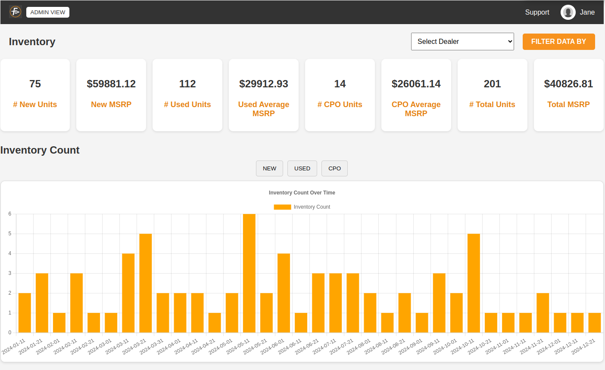
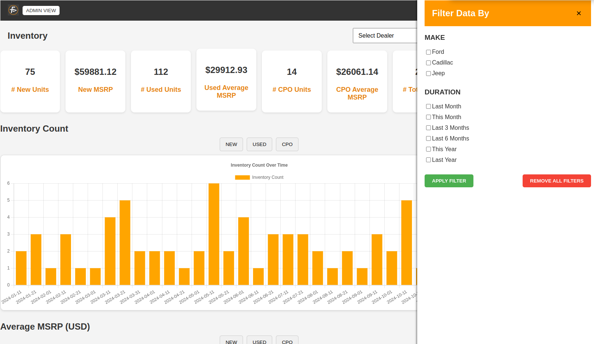

# Inventory Management Dashboard

The Inventory Management Dashboard is a web application designed to help users manage vehicle inventory effectively. It provides features for filtering data, displaying key metrics, and maintaining a detailed history log of inventory items.

## Table of Contents

- [Project Overview](#project-overview)
- [Setup and Installation](#setup-and-installation)
  - [Prerequisites](#prerequisites)
  - [Installation Steps](#installation-steps)
- [API Documentation](#api-documentation)
  - [Endpoints](#endpoints)
- [Application Usage](#application-usage)
  - [Dashboard Components](#dashboard-components)
  - [Filtering Data](#filtering-data)
- [Components and Architecture](#components-and-architecture)
  - [Frontend Structure](#frontend-structure)
  - [State Management](#state-management)
  - [Backend Structure](#backend-structure)
- [Code and Libraries](#code-and-libraries)
- [Testing](#testing)
- [Deployment](#deployment)
  - [Backend Deployment](#backend-deployment)
  - [Frontend Deployment](#frontend-deployment)
- [Additional Notes](#additional-notes)
  - [Development Time](#development-time)

---

## Project Overview

The **Inventory Management Dashboard** is a web application developed using React for the frontend and Express.js for the backend. It enables users to manage vehicle inventory effectively by offering features such as filtering by vehicle make, condition, and duration, displaying inventory counts and average MSRP, and providing a detailed history log of the inventory.

---

## Setup and Installation

### Prerequisites

- Node.js (version 14.x or later)
- npm (version 6.x or later) or yarn (version 1.x or later)

### Installation Steps

1. **Clone the repository:**

   ```bash
   git clone https://github.com/bhaskar8074/fountain-forward-technical-exam.git
   cd fountain-forward-technical-exam
   ```

2. **Backend Setup:**

   ```bash
   cd backend
   npm install
   npm start
   ```

3. **Frontend Setup:**

   ```bash
   cd dashboard-app
   npm install
   npm start
   ```

4. **Accessing the Application:**

   Open your web browser and go to `http://localhost:3000` to view the Inventory Management Dashboard.

---

## API Documentation

**Base URL:** `http://localhost:5000/api`

### Endpoints

1. **GET /inventory**
   - **Description:** Retrieves inventory data with optional filtering capabilities.
   - **Query Parameters:**
     - `make` (optional): Specifies the vehicle make to filter by (e.g., `ford`, `cadillac`).
     - `condition` (optional): Specifies the vehicle condition to filter by (`new`, `used`, `cpo`).
     - `duration` (optional): Specifies the time range to filter by (`last-month`, `this-month`, `last-3-months`, `last-6-months`, `this-year`, `last-year`).
   - **Response Example:**
     ```json
     [
       {
         "id": "1",
         "make": "Ford",
         "model": "Mustang",
         "price": "35000 USD",
         "condition": "new",
         "timestamp": "2023-05-12T14:48:00.000Z"
       },
       {
         "id": "2",
         "make": "Cadillac",
         "model": "Escalade",
         "price": "75000 USD",
         "condition": "cpo",
         "timestamp": "2022-12-10T14:48:00.000Z"
       }
     ]
     ```

---

## Application Usage

### Dashboard Components

- **Dashboard Cards:** Display key metrics such as inventory counts and average MSRP for different vehicle conditions (New, Used, CPO).
- **Charts:** Provide visual representations of inventory trends over time.
- **History Log:** Lists all inventory items with detailed information, supporting pagination for easier browsing.

### Filtering Data

- Use the sidebar filters to select vehicle make and duration criteria.
- Click the "APPLY FILTER" button to update the displayed data according to the selected filters.

---

## Components and Architecture

### Frontend Structure

- **App Component:** Main layout container managing overall state and routing.
- **Navbar:** Navigation links to different dashboard sections.
- **DashboardCards:** Displays summary information like inventory counts and average MSRP.
- **Charts:** Renders data visualizations to illustrate inventory statistics.
- **HistoryLog:** Shows detailed inventory item logs with pagination for user-friendly browsing.
- **FilterSection:** Allows users to apply filters based on vehicle make and duration.

### State Management

- **Redux Toolkit:** Centralizes and manages application state, including inventory data and filters.
- **Slices:**
  - **inventorySlice:** Manages state related to inventory data, filters, and async actions for data fetching.

### Backend Structure

- **Express Server:** Serves API endpoints and handles data requests.
- **Routes:**
  - **/api/inventory:** Endpoint for fetching and filtering inventory data.

---

## Code and Libraries

- **React:** JavaScript library for building user interfaces.
- **Redux Toolkit:** Library for managing and centralizing application state.
- **Axios:** Promise-based HTTP client for making API requests.
- **Express:** Minimal and flexible Node.js web application framework.
- **papaparse:** Library for reading and parsing CSV data on the backend.

---

## Testing

- **Jest and React Testing Library:** Used for both frontend component and backend testing.

---

## Additional Notes

- **Development Time:** 7 hrs.

## Screenshots

### Dashboard


*Figure 1: Overview of the Dashboard displaying key metrics.*

### Filtering


*Figure 2: Filtering options for selecting vehicle make and duration.*
